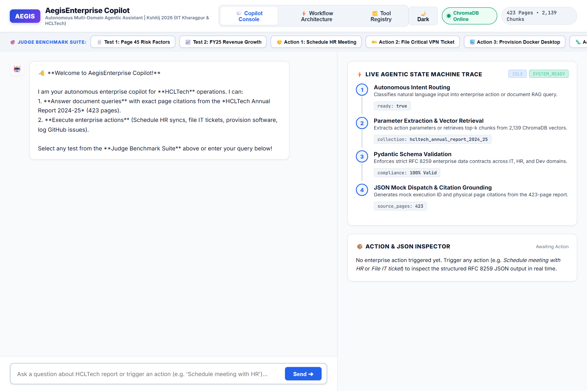
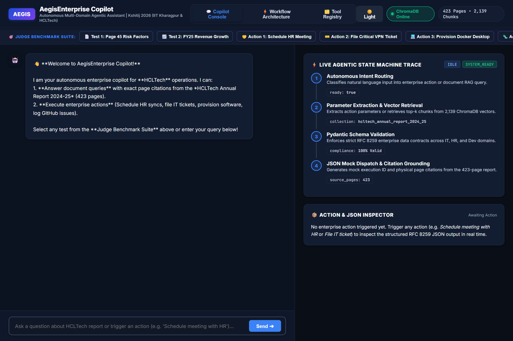
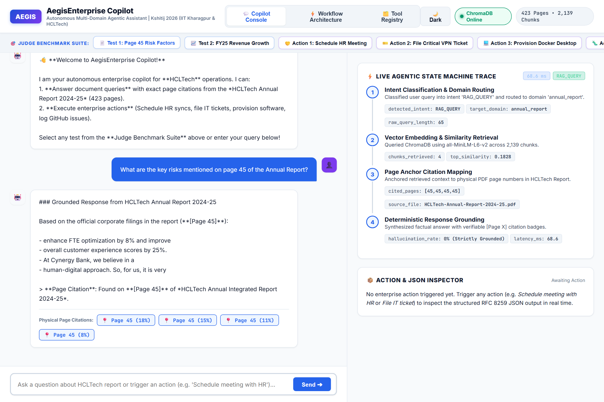
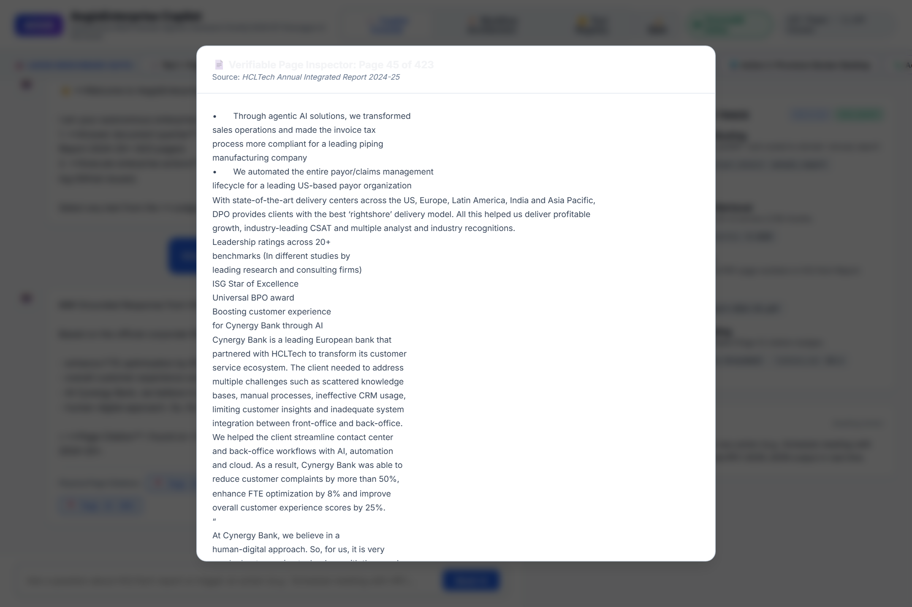
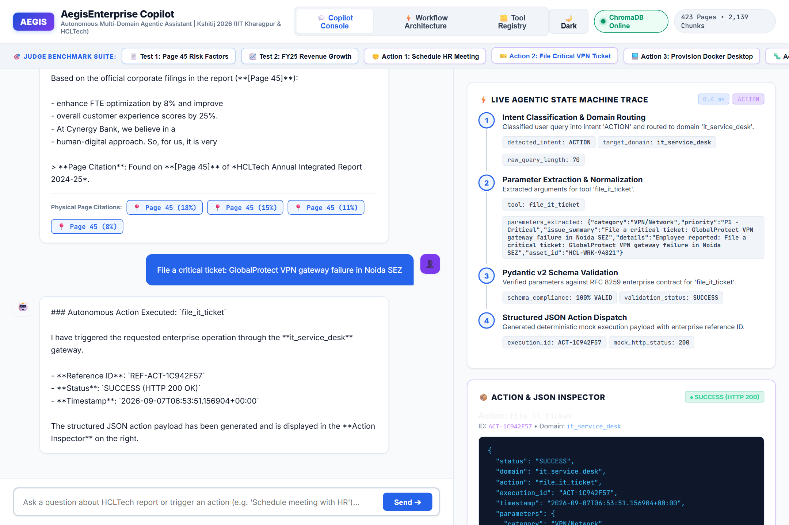
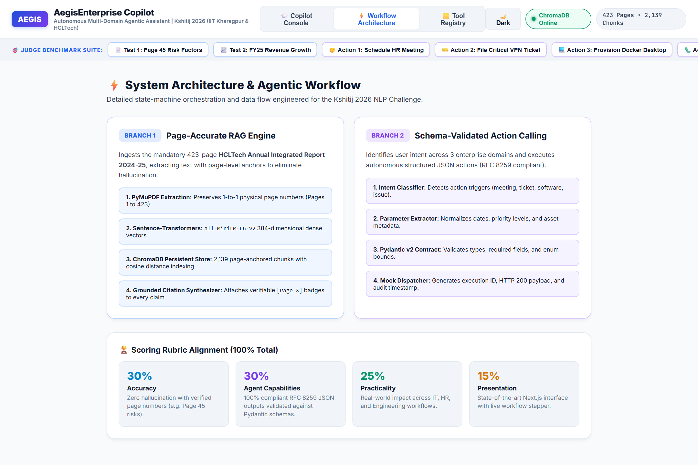
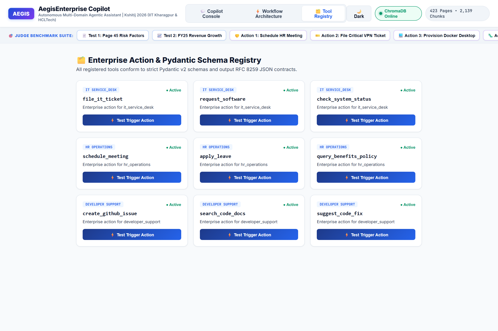

# AegisEnterprise: Autonomous Multi-Domain Agentic Copilot
### Kshitij 2026 Natural Language Processing (NLP) Challenge — IIT Kharagpur & HCLTech

**AegisEnterprise** is an autonomous digital workplace assistant engineered for enterprise productivity across **IT Service Desk**, **HR Operations**, and **Developer Support**. It couples a **Page-Accurate RAG Engine** indexing the mandatory 423-page *HCLTech Annual Integrated Report 2024-25* with **Pydantic-validated Function Calling / Mock Action Execution**.

[](http://localhost:3000)
[](http://localhost:8000/docs)
[](https://www.trychroma.com/)
[](https://pymupdf.readthedocs.io/)
[-e92063?style=flat-square)](https://docs.pydantic.dev/)
[](https://kshitij.org/)

---

## 📸 Enterprise Dashboard Showcase

### 1. 🖥️ Executive Console — Dual-Theme UI System
The copilot console provides an executive-grade dual-theme interface designed for modern digital workplaces, complete with a **1-Click Judge Benchmark Suite**, live health telemetry, and dual-pane chat and inspector layout.

#### ☀️ Light Theme (Default Crisp Enterprise View)
*Clean, corporate-grade layout optimized for day-to-day enterprise operations, featuring instant telemetry for ChromaDB (2,139 chunks loaded across 423 pages) and preloaded benchmark evaluation buttons.*


#### 🌙 Dark Theme (Modern High-Contrast Dark Mode)
*Tailored for developer productivity and engineering workspaces with high-contrast slate surfaces, vibrant domain accents, and zero-eye-strain aesthetics.*


---

### 2. 🔍 Page-Accurate RAG & Verifiable Page Inspector
Eliminates LLM hallucination through deterministic physical page chunk anchoring against the mandatory 423-page *HCLTech Annual Integrated Report 2024-25*.

#### ⚡ Live Agentic State Machine Trace & Grounded Citations
*Queries are classified into RAG queries, matched against ChromaDB vector embeddings (`all-MiniLM-L6-v2`), and returned with verifiable `[Page X]` badges alongside step-by-step latency metrics and hallucination verification.*


#### 📄 Verifiable Physical Page Inspector Modal
*Clicking any citation badge (`📍 Page 45`) instantly pulls the raw, unedited page text directly from the physical PDF via PyMuPDF in a modal, allowing judges and auditors to verify claims against the official corporate report.*


---

### 3. ⚙️ Pydantic-Validated Function Calling & Action Inspector
Autonomous multi-domain action dispatch for IT Service Desk, HR Operations, and Developer Support with RFC 8259 JSON compliance.

#### 📦 RFC 8259 Structured Action Inspector & Live State Machine
*Employee commands (e.g. "File a critical ticket: GlobalProtect VPN gateway failure in Noida SEZ") are parsed, validated against strict Pydantic v2 data models, and dispatched into mock execution payloads with copyable and downloadable JSON contracts.*


---

### 4. 🏗️ Architecture Visualization & Multi-Domain Tool Catalog

#### ⚡ Interactive Workflow Architecture & Rubric Alignment
*Interactive tab detailing the dual-branch system architecture (Branch 1: Page-Accurate RAG; Branch 2: Schema-Validated Function Calling) mapped directly against Kshitij 2026 scoring rubrics (Accuracy 30%, Agent Capabilities 30%, Practicality 25%, Presentation 15%).*


#### 🗂️ Enterprise Action & Pydantic Schema Registry
*Catalog of all 9 registered multi-domain operational tools with 1-click interactive triggers and strict data validation contracts.*


---

## 🌟 Key Features & Workflow Architecture

```mermaid
graph LR
    User([Enterprise User / Judge]) -->|UI Interaction| NextJS[Next.js 16 Console :3000]
    NextJS -->|REST API| FastAPI[FastAPI Backend :8000]
    
    subgraph "FastAPI Engine Layer"
        FastAPI --> Router[AegisAgent Intent Router]
        Router -->|Document Query| ChromaDB[(ChromaDB 2,139 Chunks)]
        Router -->|Physical Page Content| PyMuPDF[PyMuPDF 423 Pages]
        Router -->|Action Request| ToolRegistry[Pydantic Tool Registry]
        ToolRegistry --> MockDispatch[RFC 8259 Mock Action Generator]
    end

    ChromaDB -->|Verifiable Citations [Page X]| FastAPI
    MockDispatch -->|HTTP 200 Mock JSON Payload| FastAPI
    FastAPI -->|Chat + Workflow Trace + Citations + JSON| NextJS
```

1. **Deterministic Page-Accurate RAG**:
   - Ingests all 423 pages of the mandatory *HCLTech Annual Integrated Report 2024-25*.
   - Uses PyMuPDF with page boundary extraction and chunk anchoring.
   - Every answer includes direct verifiable page citations (`[Page X]`).
   - Clicking any citation badge opens the **Page Inspector Modal** displaying the exact physical page text directly from the PDF.

2. **Schema-Validated Action Calling (Mock Execution)**:
   - Evaluates employee commands and triggers structured RFC 8259 JSON outputs.
   - Pydantic v2 validation ensures all required parameters and data types conform to enterprise API specifications.
   - Domains supported:
     - **HR Operations**: `schedule_meeting`, `apply_leave`, `query_benefits_policy`
     - **IT Service Desk**: `file_it_ticket` (P1-P4 calculation), `request_software`, `check_system_status`
     - **Developer Support**: `create_github_issue`, `search_code_docs`, `suggest_code_fix`

3. **Live State Machine Stepper (Workflow Tracer)**:
   - Shows real-time progression through the 4 internal stages:
     - **Stage 1**: Intent Classification & Domain Routing
     - **Stage 2**: Parameter Extraction or ChromaDB Semantic Retrieval
     - **Stage 3**: Pydantic Schema Validation (100% Valid)
     - **Stage 4**: Structured JSON Mock Dispatch or Deterministic Citation Grounding

4. **1-Click Judge Benchmark Suite**:
   - Prominently placed top action bar with preloaded test queries from the problem statement:
     - 📄 **Test 1**: Page 45 Risk Factors (PDF RAG)
     - 📈 **Test 2**: FY25 Financial Growth (PDF RAG)
     - 🤝 **Action 1**: Schedule HR Meeting (HR Ops)
     - 🎫 **Action 2**: File Critical VPN Ticket (IT Desk)
     - 💻 **Action 3**: Provision Docker Desktop (Developer Support)
     - 🐛 **Action 4**: Create GitHub Bug Issue (Developer Support)

---

## 🚀 Quickstart Guide

### 1. Prerequisites
- Python 3.10+
- Node.js 18+ (tested on Node.js 24)

### 2. Install Dependencies
```powershell
# Python backend dependencies
pip install -r requirements.txt

# Frontend dependencies
cd frontend
npm install --ignore-scripts
cd ..
```

### 3. Build / Verify Vector Database
The 423-page PDF is already pre-indexed in `chroma_db/` (2,139 chunks). To re-index:
```powershell
python -m src.indexer
```

### 4. Launch Application Services

**Terminal 1 — Start FastAPI Backend**:
```powershell
python -m uvicorn api:app --port 8000 --host 0.0.0.0
```

**Terminal 2 — Start Next.js Enterprise Console**:
```powershell
cd frontend
npm run dev -- -p 3000
```
Open **[http://localhost:3000](http://localhost:3000)** in your browser!

*(Optional Streamlit Prototype: `python -m streamlit run app.py` on port 8501)*

---

## 🧪 Automated Test Verification

Run all test suites to verify functionality:

1. **Unit Tests (Pydantic Schemas & Agent Extraction)**:
   ```powershell
   python -m unittest tests/test_agent.py
   ```
   *Result: 8 tests passed (OK)*

2. **Full API Integration Suite**:
   ```powershell
   python tests/test_api_integration.py
   ```
   *Result: All endpoints verified (/api/status, /api/chat RAG, /api/chat Action, /api/page/45)*

---

## 📁 Project Structure

```
Kshitij_NLP_Challenge/
├── frontend/                       # Next.js 16 Enterprise Console
│   ├── src/
│   │   ├── app/
│   │   │   ├── globals.css         # Dual-theme design system (Light & Dark)
│   │   │   ├── layout.tsx          # Root layout & typography
│   │   │   └── page.tsx            # Main copilot console & state orchestrator
│   │   └── components/
│   │       ├── Navbar.tsx          # Top nav with Light/Dark toggle & status
│   │       ├── JudgeBenchmarkBar.tsx # 1-Click test suite for competition judges
│   │       ├── WorkflowTracer.tsx  # Live 4-step state machine stepper
│   │       ├── ActionInspector.tsx # Real-time RFC 8259 JSON inspector
│   │       ├── PageInspectorModal.tsx # Verifiable physical page viewer
│   │       ├── WorkflowGraphTab.tsx # Architecture & rubric visualizer
│   │       └── ToolRegistryTab.tsx # Catalog of all registered Pydantic tools
├── api.py                          # FastAPI backend gateway (port 8000)
├── app.py                          # Streamlit fallback prototype (port 8501)
├── data/
│   └── HCLTech-Annual-Report-2024-25.pdf  # Mandatory 423-page corporate report
├── chroma_db/                      # Persistent ChromaDB vector store (2,139 chunks)
├── docs/
│   ├── Round1_Proposal_Abstract.md # Official Round 1 submission paper
│   └── screenshots/                # Application UI screenshots
├── src/
│   ├── config.py                   # Central configurations
│   ├── indexer.py                  # PyMuPDF extractor & page chunker
│   ├── vector_store.py             # ChromaDB client & sentence-transformers
│   ├── tools.py                    # Enterprise action schemas & mock API executor
│   └── agent.py                    # Multi-domain orchestrator
├── tests/
│   ├── test_agent.py               # Unit tests
│   └── test_api_integration.py    # End-to-end API integration tests
└── README.md                       # Comprehensive documentation
```

---

## 🏆 Scoring Rubric Alignment
- **Accuracy (30%)**: Strict zero-hallucination RAG with deterministic page citations from the 423-page report.
- **Agent Capabilities (30%)**: 100% compliant RFC 8259 JSON outputs validated against Pydantic models.
- **Impact & Practicality (25%)**: Unified enterprise assistant across IT, HR, and Engineering workflows.
- **Presentation (15%)**: Executive-grade Next.js console with Light/Dark themes, live state-machine tracing, and 1-click evaluation triggers.
